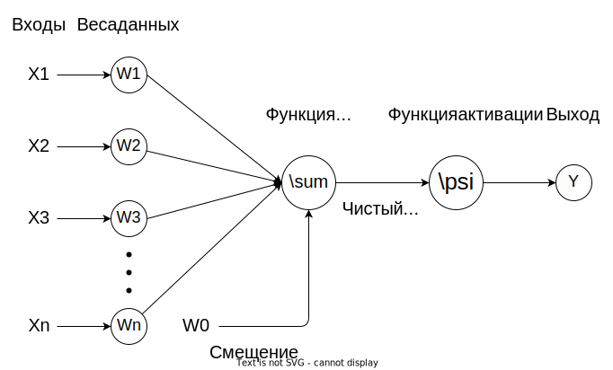

## Название проекта

Neural Storage

## Основная идея

Основная идея заключается в создании хранилища конфигураций искуственных нейронных сетей (как структуры, так и соответствующих весов обученных моделей).

Такое хранилище позволит повысить эффективность процесса обучения искуственная нейронных сетей и анализа результатов обучения, за счет снижения времязатрат на переконфигурации нейронных сетей.

## Предметная область

Предметной областью проекта являются конфигурации искуственных нейронных сетей. Искуственная нейронная сеть представляется в виде ориентированного графа, узлами которого являются "нейроны", организованные в слои. Общая схема нейрона представлена на следующем рисункке:

Так как структура нейронной сети предстваляется в виде графовой модели, органозованной послойно, ее хранение может быть организованно с помощью реляционной базы данных.

## Существующие решения

В настоящее время основными способами хранения конфигураций нейронных сетей являются:

* Хранение в виде файлов в файловой системе
    * возможно использование системы контроля версий (VSC), таких как: git, svn и пр.
* Хранение файлов конфигураций в БД

Сравним данные решения по следующим параметрам:

1. Надежность хранения
1. Быстродействие при взаимодействии с данными
1. Журналирование изменений

Приведем сравнение по данным критериям в виде таблицы:

| Критерий | ФC | VSC | Файлы в БД | Хранилище конфигураций |
|-|-|-|-|-|
|1| - | + | + | + |
|2| - | - | - | + |
|3| - | + | +/- | + |

## Актуальность

Исходя из приведенного выше сравнения существующих, можно сделать вывод об актуальности предлагаемого решения: хранилище конфигураций позволяет повысить надежность, эффективность и удобство работы с конфигурациями нейронных сетей. В связи с тем, что в последние годы тема искуственного интелекта становится все более популярной, актуальность данного проекта не вызывает вопросов.

## Use-Case диаграмма

На рисунке ниже представлена `use-case` диаграмма разрабатываемого приложения:

## ER-диаграмма сущностей

## Архитектурные характеристики важные для проекта

Данный проект представляет собой Web-SPA и будет реализован при помощи:

1. Базы данных:
    1. [PostgreSQL](https://www.postgresql.org/) - в качестве основного хранилища
    1. [Tarantool](https://www.tarantool.io/ru/) - в качестве кеша ("горячее хранилище")
1. Языки программирования:
    1. [Lua](https://www.lua.org/) - в качестве основного языка конфигурации горячего хранилища
    1. [Golang](https://go.dev/) - в качестве основного языка для реализации backend'а
    1. [JavaScript](https://developer.mozilla.org/ru/docs/Web/JavaScript) - в качестве основного языка для реализации frontend'а
1. Фреймворки:
    1. [Gin](https://github.com/gin-gonic/gin) - в качестве фреймворка для backend'а
    1. [ReactJS](https://ru.reactjs.org/) - в качестве фреймворка для frontend'а
1. Прочее:
    1. [Docker](https://www.docker.com/) - для контейнеризации
    1. [Docker-Compose](https://docs.docker.com/compose/) - для организации взаимодействия между частями проекта

## Компоненты

## UML-диаграммы классов

### Диаграмма компонента бизнес-логики

### Диаграмма компонента доступа к данным

## UML-диаграммы «модельных» классов сущностей

### Диаграмма классов компонента доступа к данным

### Диаграмма классов бизнес логики

### Диаграмма компонета связи между бизнес-логикой и UI

### Диаграмма классов транспортного уровня

В настоящий момент совпадает с [диаграммой моделей бизнес-логики](#диаграмма-классов-бизнес-логики), будет дорабатываться отдельно.

## Черновые эскизы экранов

## Работа по HTTP/3

